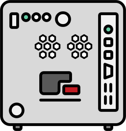
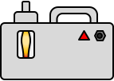

# Aerosol Icon Project
 
A public icon pack for a range of common aerosol-related devices, provided as SVGs (a subset) or in PPTX. Sample icons are shown below.

## Design principles

Contributions should attempt to adhere to the following principles: 

1. Instrument manufacturer logos are not explicitly used to avoid direct advertising and to avoid the unwarranted use of logos. 

2. Icons have a somewhat standardized size and line width. More details on these specifications are to come. 

3. A limited color palette on a per instrument basis, as well as a somewhat limited color palette across different icons. 

4. Moderate amounts of detail. Enough to make the icon unique and recognizable, without adding too much visual clutter. 
