# Aerosol icon project
 
### An open source set of icons for aerosol instrumentation

A public icon pack for a range of common aerosol-related devices, provided as SVGs (a subset) or in PPTX (full icon set). Sample icons are shown below.

<!--  -->

Desired icons that may be missing from this icon set can be indicated by raising an issue against this repository. 

## Design principles

Contributions should attempt to adhere to the following principles: 

1. Instrument manufacturer logos are not explicitly used to avoid direct advertising and to avoid the unwarranted use of logos. 

2. Icons have a somewhat standardized size and line width. This is currently loosely enforced in the PPTX, where all icons have a line width of 1.25 px and a similar overall size in most cases. 

3. A limited color palette on a per instrument basis, as well as a somewhat limited color palette across different icons. For example, a limited number of shades of blue are used across the icon set. 

4. Moderate amounts of detail. Enough to make the icon unique and recognizable, without adding too much visual clutter. This occasionally means removing some of the details of the instrument but allows for increased consistency, less dense icons, and the ability to scale the icons to smaller sizes. 

## Sample SVG Library

**NOTE**: Further icons are available in the PPTX version.

<!-- SVG_GRID_START -->
<table>
  <tr>
    <td align="center" valign="middle">
      <a href="svg/aac.svg">
         
      </a>
    </td>
    <td align="center" valign="middle">
      <a href="svg/aerosol-generator.svg">
         
      </a>
    </td>
    <td align="center" valign="middle">
      <a href="svg/aethalometer-0.svg">
        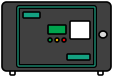 
      </a>
    </td>
    <td align="center" valign="middle">
      <a href="svg/aethalometer.svg">
         
      </a>
    </td>
  </tr>
  <tr>
    <td align="center" valign="middle">
      <a href="svg/apm.svg">
         
      </a>
    </td>
    <td align="center" valign="middle">
      <a href="svg/caps.svg">
         
      </a>
    </td>
    <td align="center" valign="middle">
      <a href="svg/catalytic-stripper.svg">
        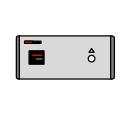 
      </a>
    </td>
    <td align="center" valign="middle">
      <a href="svg/co2-analyzer.svg">
         
      </a>
    </td>
  </tr>
  <tr>
    <td align="center" valign="middle">
      <a href="svg/cpc-2.svg">
         
      </a>
    </td>
    <td align="center" valign="middle">
      <a href="svg/cpc.svg">
         
      </a>
    </td>
    <td align="center" valign="middle">
      <a href="svg/cpma.svg">
         
      </a>
    </td>
    <td align="center" valign="middle">
      <a href="svg/cyclone.svg">
         
      </a>
    </td>
  </tr>
  <tr>
    <td align="center" valign="middle">
      <a href="svg/diluter-di-1000.svg">
         
      </a>
    </td>
    <td align="center" valign="middle">
      <a href="svg/dma-2.svg">
         
      </a>
    </td>
    <td align="center" valign="middle">
      <a href="svg/dma.svg">
         
      </a>
    </td>
    <td align="center" valign="middle">
      <a href="svg/drx.svg">
         
      </a>
    </td>
  </tr>
  <tr>
    <td align="center" valign="middle">
      <a href="svg/dryer-2.svg">
        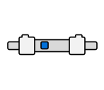 
      </a>
    </td>
    <td align="center" valign="middle">
      <a href="svg/dryer-3.svg">
        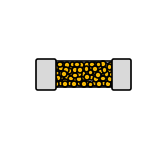 
      </a>
    </td>
    <td align="center" valign="middle">
      <a href="svg/dryer.svg">
        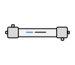 
      </a>
    </td>
    <td align="center" valign="middle">
      <a href="svg/e-diluter.svg">
        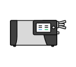 
      </a>
    </td>
  </tr>
  <tr>
    <td align="center" valign="middle">
      <a href="svg/electrospray.svg">
         
      </a>
    </td>
    <td align="center" valign="middle">
      <a href="svg/elpi.svg">
         
      </a>
    </td>
    <td align="center" valign="middle">
      <a href="svg/esp-nano.svg">
        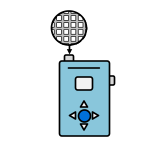 
      </a>
    </td>
    <td align="center" valign="middle">
      <a href="svg/fcae.svg">
         
      </a>
    </td>
  </tr>
  <tr>
    <td align="center" valign="middle">
      <a href="svg/filter-holder.svg">
         
      </a>
    </td>
    <td align="center" valign="middle">
      <a href="svg/fluidized-bed-generator.svg">
         
      </a>
    </td>
    <td align="center" valign="middle">
      <a href="svg/gas-cylinder.svg">
         
      </a>
    </td>
    <td align="center" valign="middle">
      <a href="svg/gas-turbine.svg">
        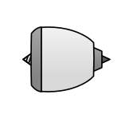 
      </a>
    </td>
  </tr>
  <tr>
    <td align="center" valign="middle">
      <a href="svg/impactor.svg">
         
      </a>
    </td>
    <td align="center" valign="middle">
      <a href="svg/lap.svg">
         
      </a>
    </td>
    <td align="center" valign="middle">
      <a href="svg/lii-300.svg">
         
      </a>
    </td>
    <td align="center" valign="middle">
      <a href="svg/magic-cpc.svg">
         
      </a>
    </td>
  </tr>
  <tr>
    <td align="center" valign="middle">
      <a href="svg/mfc.svg">
         
      </a>
    </td>
    <td align="center" valign="middle">
      <a href="svg/micro-aethalometer-1.svg">
         
      </a>
    </td>
    <td align="center" valign="middle">
      <a href="svg/micro-aethalometer-2.svg">
         
      </a>
    </td>
    <td align="center" valign="middle">
      <a href="svg/micro-aethalometer-3.svg">
         
      </a>
    </td>
  </tr>
  <tr>
    <td align="center" valign="middle">
      <a href="svg/minicast-1.svg">
         
      </a>
    </td>
    <td align="center" valign="middle">
      <a href="svg/minicast.svg">
         
      </a>
    </td>
    <td align="center" valign="middle">
      <a href="svg/misg.svg">
        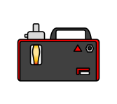 
      </a>
    </td>
    <td align="center" valign="middle">
      <a href="svg/mss.svg">
         
      </a>
    </td>
  </tr>
  <tr>
    <td align="center" valign="middle">
      <a href="svg/nano-dma.svg">
         
      </a>
    </td>
    <td align="center" valign="middle">
      <a href="svg/nebulizer-2.svg">
         
      </a>
    </td>
    <td align="center" valign="middle">
      <a href="svg/nebulizer-3.svg">
         
      </a>
    </td>
    <td align="center" valign="middle">
      <a href="svg/nebulizer.svg">
         
      </a>
    </td>
  </tr>
  <tr>
    <td align="center" valign="middle">
      <a href="svg/neutralizer-2.svg">
         
      </a>
    </td>
    <td align="center" valign="middle">
      <a href="svg/neutralizer.svg">
        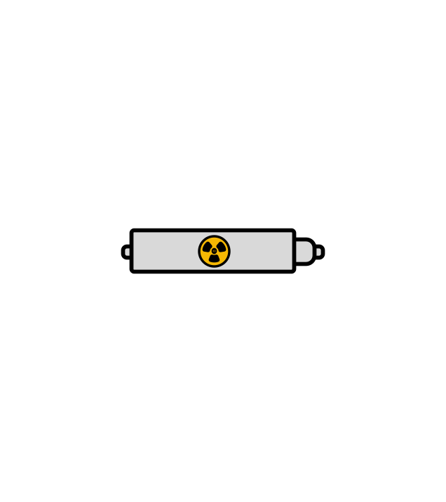 
      </a>
    </td>
    <td align="center" valign="middle">
      <a href="svg/opacimeter.svg">
        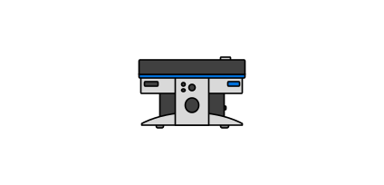 
      </a>
    </td>
    <td align="center" valign="middle">
      <a href="svg/open-cpc.svg">
         
      </a>
    </td>
  </tr>
  <tr>
    <td align="center" valign="middle">
      <a href="svg/ops.svg">
         
      </a>
    </td>
    <td align="center" valign="middle">
      <a href="svg/organic-coating-unit.svg">
        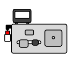 
      </a>
    </td>
    <td align="center" valign="middle">
      <a href="svg/oxidation-flow-reactor.svg">
        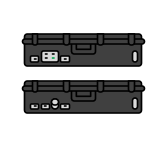 
      </a>
    </td>
    <td align="center" valign="middle">
      <a href="svg/paas.svg">
        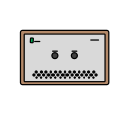 
      </a>
    </td>
  </tr>
  <tr>
    <td align="center" valign="middle">
      <a href="svg/partector-tem.svg">
         
      </a>
    </td>
    <td align="center" valign="middle">
      <a href="svg/pax.svg">
         
      </a>
    </td>
    <td align="center" valign="middle">
      <a href="svg/ptaam.svg">
        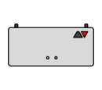 
      </a>
    </td>
    <td align="center" valign="middle">
      <a href="svg/pump-2.svg">
        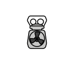 
      </a>
    </td>
  </tr>
  <tr>
    <td align="center" valign="middle">
      <a href="svg/pump.svg">
         
      </a>
    </td>
    <td align="center" valign="middle">
      <a href="svg/rotating-disk-diluter.svg">
        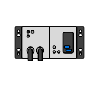 
      </a>
    </td>
    <td align="center" valign="middle">
      <a href="svg/six-jet-atomizer.svg">
        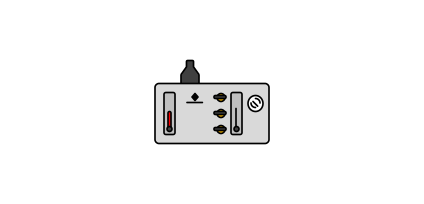 
      </a>
    </td>
    <td align="center" valign="middle">
      <a href="svg/smps.svg">
        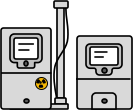 
      </a>
    </td>
  </tr>
  <tr>
    <td align="center" valign="middle">
      <a href="svg/sp2-xr.svg">
        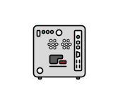 
      </a>
    </td>
    <td align="center" valign="middle">
      <a href="svg/sp2.svg">
        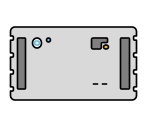 
      </a>
    </td>
    <td align="center" valign="middle">
      <a href="svg/spg.svg">
         
      </a>
    </td>
    <td align="center" valign="middle">
      <a href="svg/static-mixer.svg">
         
      </a>
    </td>
  </tr>
  <tr>
    <td align="center" valign="middle">
      <a href="svg/syringe-pump.svg">
        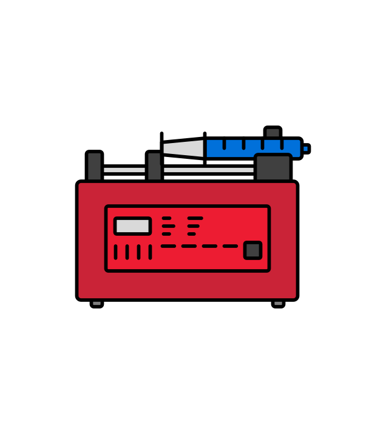 
      </a>
    </td>
    <td align="center" valign="middle">
      <a href="svg/teom.svg">
        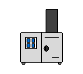 
      </a>
    </td>
    <td align="center" valign="middle">
      <a href="svg/thermophoretic-sampler.svg">
        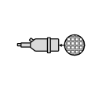 
      </a>
    </td>
    <td align="center" valign="middle">
      <a href="svg/udac.svg">
         
      </a>
    </td>
  </tr>
</table>
<!-- SVG_GRID_END -->