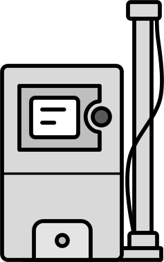

# Aerosol Icon Project
 
A public icon pack for a range of common aerosol-related devices. Sample icons are shown below.

 
 
 

## Rules

We apply the following principles to these icons: 

1. Instrument manufacturer logos are not explicitly used to avoid direct advertising and to avoid the unwarranted use of logos. 

2. Icons have a somewhat standardized size and line width. More details on these specifications are to come. 
